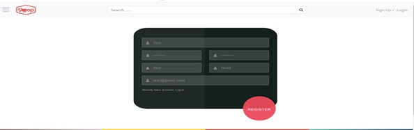
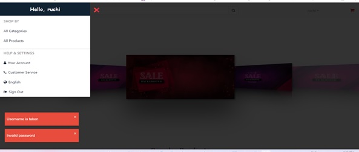
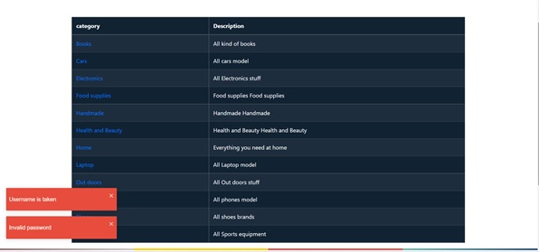
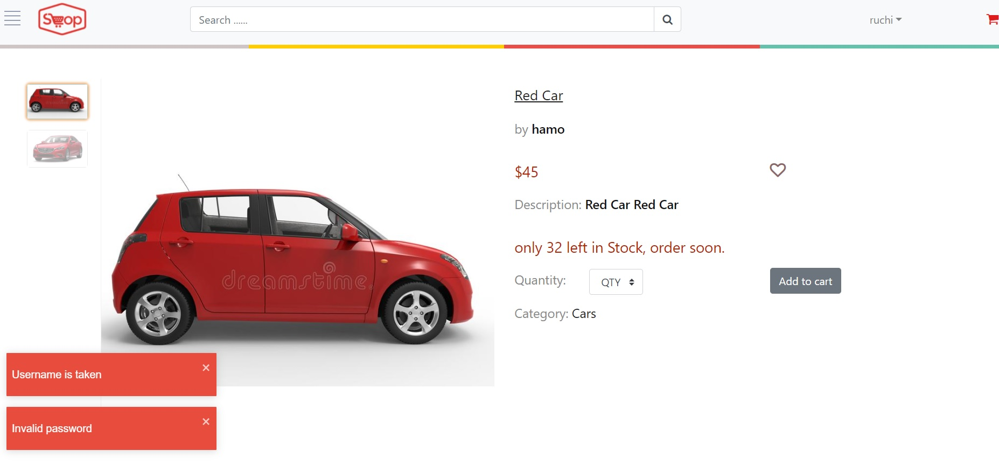

<h1 align="center">  🛒 &nbsp; Shopping App 🛒 </h1>

> Built with MERN stack (MongoDB, Express, React and Node).

## 📜 &nbsp; Table of contents

- [Description](#description)
- [Technologies](#technologies)
- [Installation](#installation)
- [Links](#links)
- [Screenshots](#screenshots)
- [Questions](#questions)

## 🚩 Description

> This App was made to track the order state since the customer place it
> once it's shipped the seller mark it as shipped, and then the shipper mark it as delivered.

## Technologies
> Project is created with:

#### Backend

- Express
- Mongoose
- Json Web Token (For authentication)
- bcryptjs (for data encryption)

#### Frontend

- React JS
- Redux (Manage app state)
- React-router (To handle routing)
- React Bootstrap
- React-toastify (To handle success and error messages)
- Yup (To handle client side form validation)

## Installation

To run this project, install it locally using npm:

```
$ npm install (install backend dependencies)
$ npm install (install frontend dependencies)
$ npm run server (for Node server side development)
$ npm run client (for React client side development)
$ npm run dev (for both client and server side)
```


## Links
* [The URL of the GitHub repository](https://github.com/Ruchi479/E-Shop.git)

* [The URL of application deployed on heroku](https://afternoon-atoll-93127.herokuapp.com/)

## Screenshots






## Questions?
For inquiries, please contact [Ruchi](https://github.com/Ruchi479).